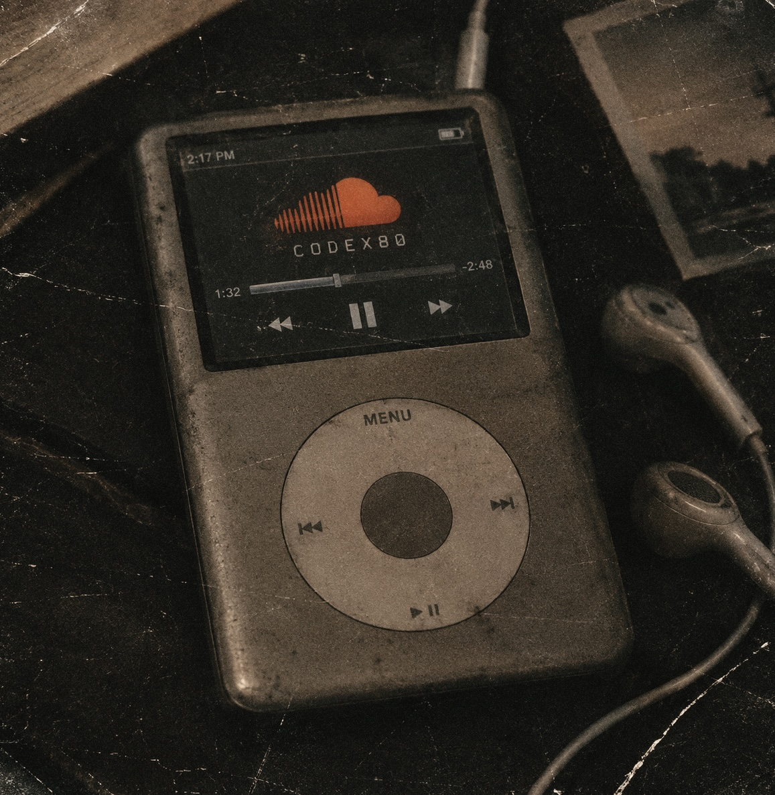

<div align="center">


<br>

<sub>✦ security · backend · testing · CTF ✦</sub>

</div>

<div align="left">


</div>

Развиваюсь на пересечении **AppSec**, backend и manual QA. Пишу собственные сервисы, разбираю их с точки зрения безопасности и постепенно углубляюсь в архитектуру, API и практику поиска уязвимостей. 

Простой парень, который любит послушать неслушабельную музыку🥀

Основные направления:

- **AppSec** — анализ веб-приложений, моделирование угроз, OWASP;
- **Go backend** — REST API, PostgreSQL, WebSocket, Docker;
- **Manual QA** — проверка API, авторизации, запросов и ответов, оформление дефектов, нагрузочное тестирование;
- **CTF** — web, forensics, network, steg.
- **Leetcode** — easy, medium tasks

<div align="left">


</div>

### `languages`

<p>


</p>

### `backend`

<p>


</p>

### `database & infrastructure`

<p>


</p>

### `manual QA`
<p>


</p>

### `systems & tools`

<p>


</p>

### `security`

<p>


</p>


<div align="left">


</div>

| Project | Description | Stack |
|:--|:--|:--|
| **[Hearyou](https://github.com/GanghouDuf/Hearyou)** | Realtime-чат с комнатами, WebSocket и авторизацией | `Go` `WebSocket` `JWT` |
| **[TodoList](https://github.com/GanghouDuf/TodoList)** | REST API со слоистой архитектурой Handler → Service → Repository | `Go` `PostgreSQL` `gorilla/mux` |
| **[LibRary](https://github.com/GanghouDuf/Library)** | web-сервис для библиотеки | `Go` `Postgres` |
| **CTF writeups** | Мб скоро будут, пока лень | `CTF` `Web` `Forensics` `Steg` |

<div align="left">


</div>

Участвую в CTF-соревнованиях и практикуюсь на PortSwigger по веб-безопасности.


### --- `my CTF team`

<div align="left">

**CODEX80**



</div>

<div align="left">


</div>

```text
[+] Go backend
[+] Application Security
[+] Manual QA
[+] Web security
[+] CTF
[+] Linux & networking
```

<div align="left">


</div>


<br>

<a href="https://github.com/GanghouDuf">

</a>

<br><br>

<sub>✦ built with curiosity, broken things and too much coffee ✦</sub>

</div>
